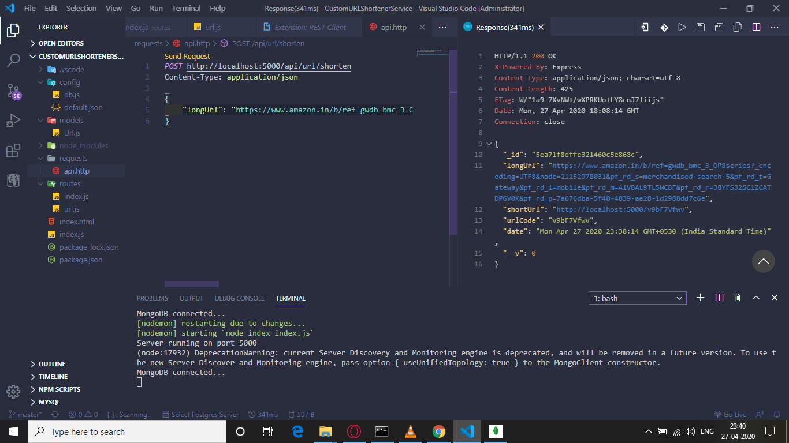
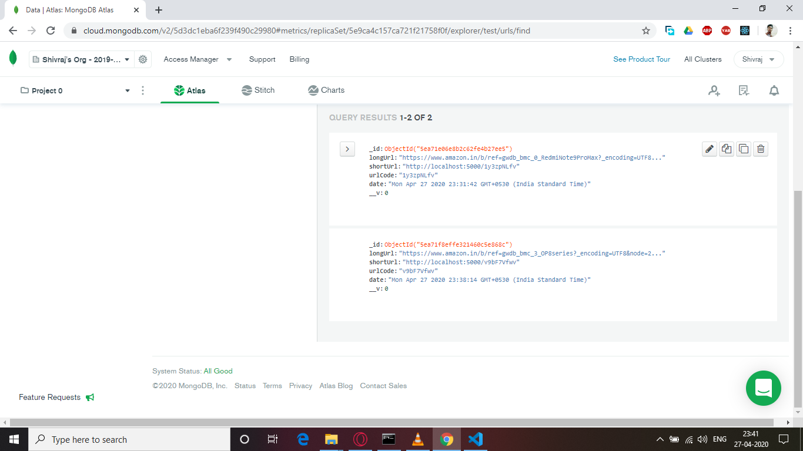

# Custom URL Shortener Service
## A simple url shortening servie made using express and mongoDB. This is only the backend api service.
## Dependencies
express, config, mongoose, shortid and valid-url
## Dev Dependencies
nodemon

VS Code/ REST Client Extension: 

MongoDB Cluster Collections: 

